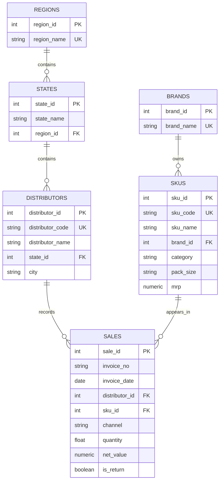

## Database Schema

```mermaid
erDiagram
    REGIONS ||--o{ STATES : contains
    STATES ||--o{ DISTRIBUTORS : contains
    DISTRIBUTORS ||--o{ SALES : records
    BRANDS ||--o{ SKUS : owns
    SKUS ||--o{ SALES : appears_in

    REGIONS {
        int region_id PK
        string region_name UK
    }

    STATES {
        int state_id PK
        string state_name
        int region_id FK
    }

    DISTRIBUTORS {
        int distributor_id PK
        string distributor_code UK
        string distributor_name
        int state_id FK
        string city
    }

    BRANDS {
        int brand_id PK
        string brand_name UK
    }

    SKUS {
        int sku_id PK
        string sku_code UK
        string sku_name
        int brand_id FK
        string category
        string pack_size
        numeric mrp
    }

    SALES {
        int sale_id PK
        string invoice_no
        date invoice_date
        int distributor_id FK
        int sku_id FK
        string channel
        float quantity
        numeric net_value
        boolean is_return
    }
```
